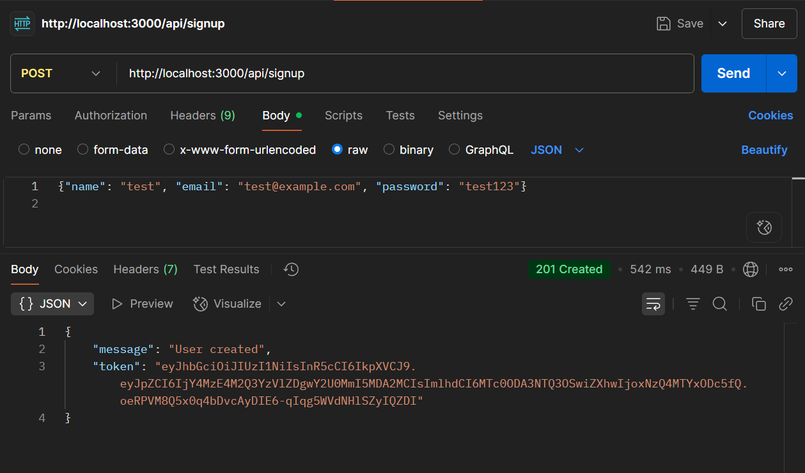
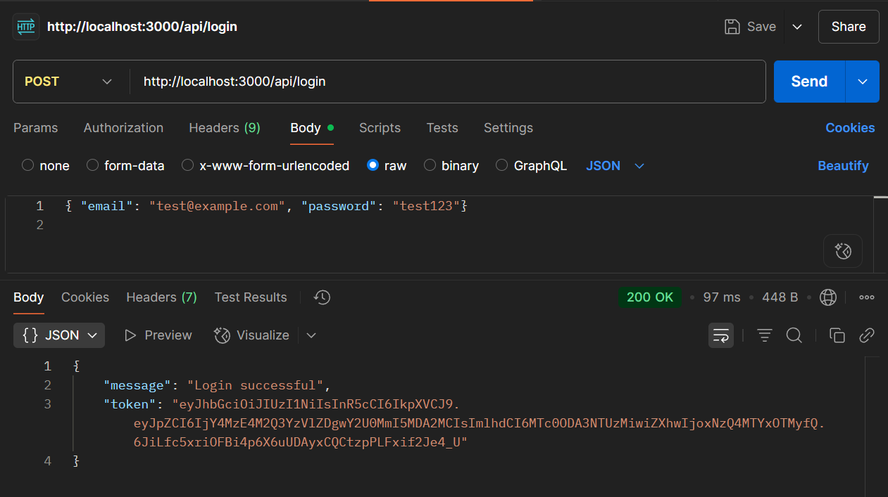
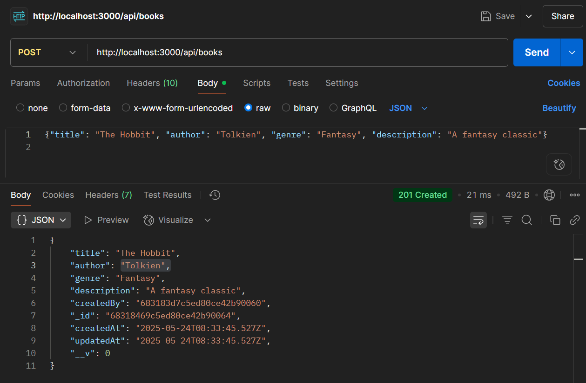
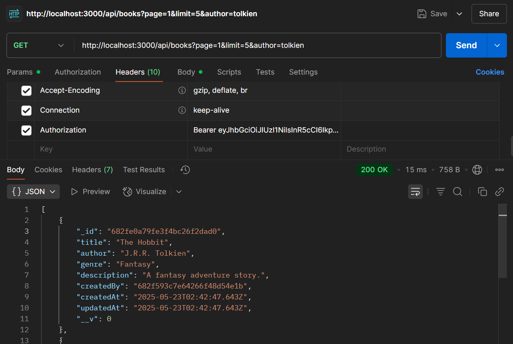
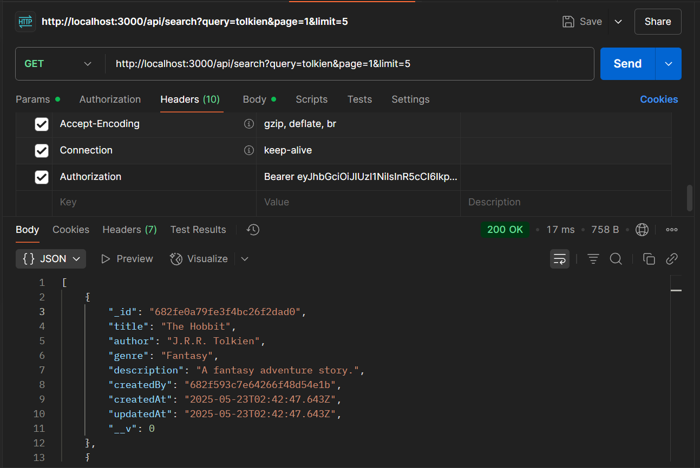
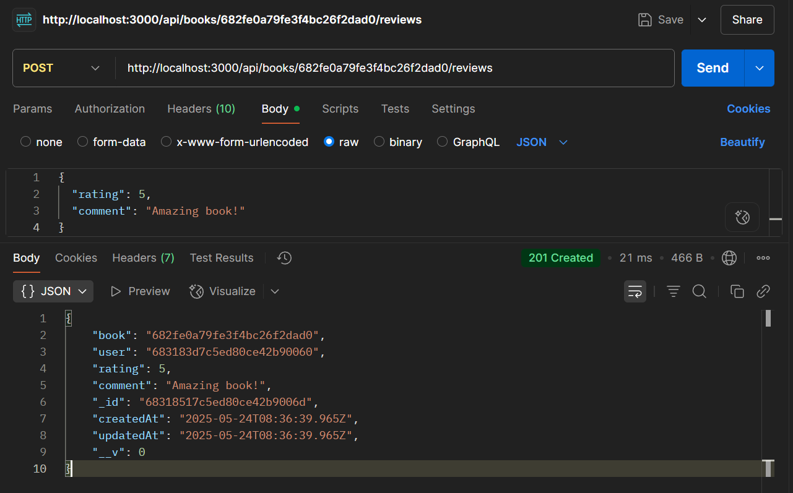
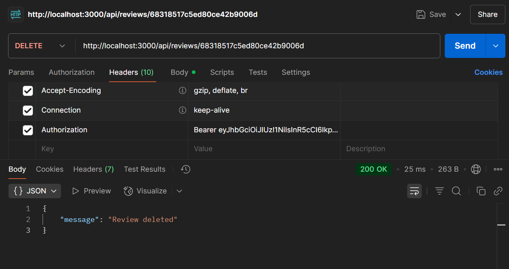

# 📚 Book Review API

A RESTful API built with Node.js and Express that allows users to sign up, log in, add books, write reviews, and search for books. JWT authentication and MongoDB are used for secure and scalable data management.

---

## 🔧 Tech Stack

- **Node.js** with **Express.js**
- **MongoDB** with **Mongoose**
- **JWT** for Authentication
- **bcrypt** for Password Hashing
- **dotenv** for Environment Variables

---

## 🚀 Setup Instructions

### 1. Clone the Repository

```bash
git clone https://github.com/Aayushs1602/book-review-api.git
cd book-review-api
```

### 2. Install Dependencies:
```bash
   npm install
```

### 3. Set Up Environment Variables:
   Create a `.env` file:
   PORT=3000
   MONGO_URI=mongodb://127.0.0.1:27017/bookReviewDB
   JWT_SECRET=yourSecretKey

### 4. Start MongoDB and the Server:
   If you're using MongoDB locally (with Compass), make sure MongoDB is running.

### 5. Start the Server
```bash
npx nodemon app.js
```
### 🧩 Database Schema Overview
### 📘 User
Stores registered user details and hashed passwords.
| Field                     | Type     | Description               |
| ------------------------- | -------- | ------------------------- |
| `_id`                     | ObjectId | Auto-generated by MongoDB |
| `name`                    | String   | Full name of the user     |
| `email`                   | String   | Unique email address      |
| `password`                | String   | Hashed password           |
| `createdAt` / `updatedAt` | Date     | Timestamps (auto-managed) |

### 📚 Book
Stores book data added by users.
| Field                     | Type            | Description                       |
| ------------------------- | --------------- | --------------------------------- |
| `_id`                     | ObjectId        | Auto-generated by MongoDB         |
| `title`                   | String          | Title of the book                 |
| `author`                  | String          | Author of the book                |
| `genre`                   | String          | Genre or category (e.g., Fiction) |
| `description`             | String          | Optional summary of the book      |
| `createdBy`               | ObjectId → User | Reference to user who added it    |
| `createdAt` / `updatedAt` | Date            | Timestamps                        |

### ✍️ Review
Stores user-submitted reviews for books.
| Field                     | Type            | Description                     |
| ------------------------- | --------------- | ------------------------------- |
| `_id`                     | ObjectId        | Auto-generated by MongoDB       |
| `book`                    | ObjectId → Book | Reference to the reviewed book  |
| `user`                    | ObjectId → User | Reference to the reviewing user |
| `rating`                  | Number          | Rating (1 to 5)                 |
| `comment`                 | String          | Optional text review            |
| `createdAt` / `updatedAt` | Date            | Timestamps                      |

### 🔐 Relationships
- A User can add many Books
- A User can post one Review per Book
- A Book can have many Reviews
- Each Review belongs to one User and one Book

### 🔐 Authentication Routes
| Method | Route         | Description             |
| ------ | ------------- | ----------------------- |
| POST   | `/api/signup` | Register new user       |
| POST   | `/api/login`  | Login and get JWT token |


### 📚 Book Routes
| Method | Route                | Description                      |
| ------ | -------------------- | -------------------------------- |
| POST   | `/api/books`         | Add a book (auth required)       |
| GET    | `/api/books`         | Get all books (supports filters) |
| GET    | `/api/books/:id`     | Get a book by ID with reviews    |
| GET    | `/api/search?query=` | Search books by title or author  |


### ✏️ Review Routes
| Method | Route                    | Description                            |
| ------ | ------------------------ | -------------------------------------- |
| POST   | `/api/books/:id/reviews` | Add a review to a book (auth required) |
| PUT    | `/api/reviews/:id`       | Update your review                     |
| DELETE | `/api/reviews/:id`       | Delete your review                     |


### 🧪 Example API Requests (curl)
### Signup
```bash
curl -X POST http://localhost:3000/api/signup \
  -H "Content-Type: application/json" \
  -d '{"name": "test", "email": "test@example.com", "password": "test123"}'
```


### Login
```bash
curl -X POST http://localhost:3000/api/login \
  -H "Content-Type: application/json" \
  -d '{"email": "test@example.com", "password": "test123"}'
```


### Add Book (requires token)
```bash
curl -X POST http://localhost:3000/api/books \
  -H "Content-Type: application/json" \
  -H "Authorization: Bearer <your_token>" \
  -d '{"title": "The Hobbit", "author": "Tolkien", "genre": "Fantasy", "description": "A fantasy classic"}'
```


### ✅ Get All Books 
```bash
GET /api/books?page=1&limit=5&author=tolkien
```


### 🔍 Search Books
```bash
GET /api/search?query=tolkien&page=1&limit=5
```


### ✅ Add Review 
```bash
POST /api/books/:id/reviews
Authorization: Bearer <your_token>
Content-Type: application/json

{
  "rating": 5,
  "comment": "Amazing book!"
}
```


### ✅ Update Review
```bash
PUT /api/reviews/:id
Authorization: Bearer <your_token>
Content-Type: application/json

{
  "rating": 4,
  "comment": "Updated my review after second read."
}
```


### ✅ Delete Review
```bash
DELETE /api/reviews/:id
Authorization: Bearer <your_token>
```


### 🗂️ Project Structure
```bash
book-review-api/
├── controllers/
│   ├── authController.js
│   └── bookController.js
├── middleware/
│   └── authMiddleware.js
├── models/
│   ├── User.js
│   ├── Book.js
│   └── Review.js
├── routes/
│   ├── authRoutes.js
│   └── bookRoutes.js
├── .env
├── .gitignore
├── app.js
└── README.md
```

### 🧠 Design Notes

- Users can only post one review per book
- All POST/PUT/DELETE routes require authentication (Bearer <JWT token>)
- Tokens are generated using jsonwebtoken and stored client-side
- Passwords are hashed using bcrypt before storage
- Pagination supported via query params (?page=1&limit=5)
- Search supports partial, case-insensitive matching on title/author

